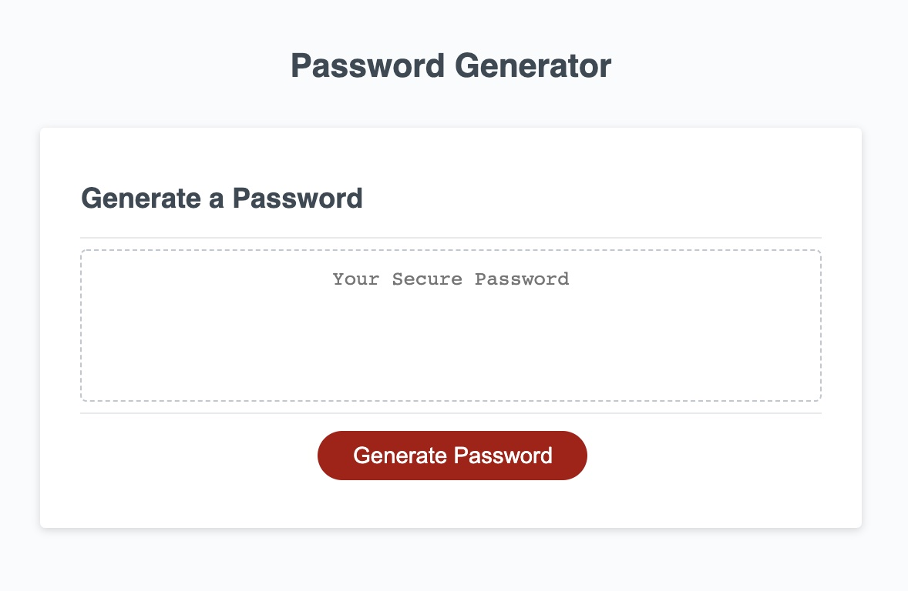
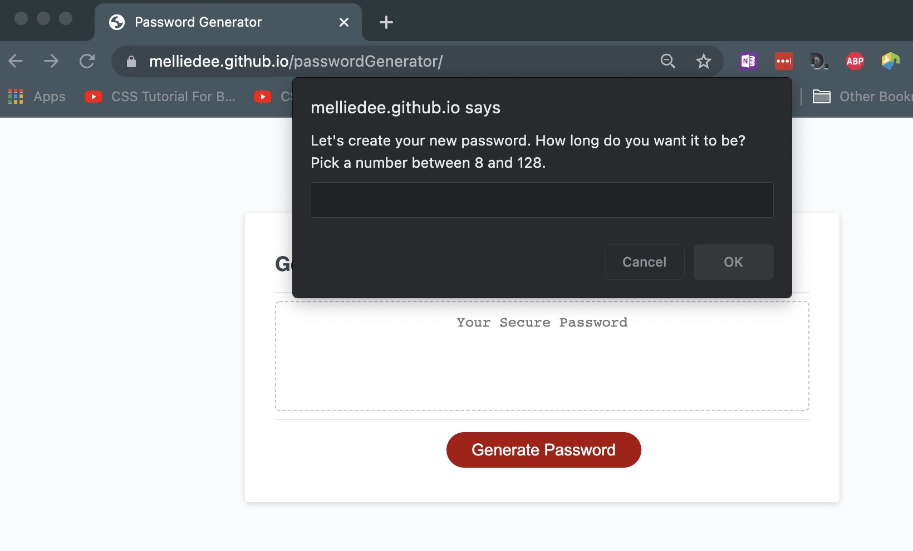

# Password Generator

## Purpose
***

To create a site that will randomly generate a password that is between 8-128 characters long and meets other certain criteria as determined by the user, thus increasing security for the user

&nbsp;

## Desired
***
1. Clicking the “Gen PW” button initiates a series of UI  prompts for password criteria
2.	Then user gets to choose which criteria to include when   gen pw
      *  Length between 8 – 128
      *  Character type
          *  Confirm lower
          *  Confirm upper
          *  Confirm numbers
          *  Confirm Special

3.	User input is validated, confirming at least 1 character type is selected
4.	When all prompts are answered then a password is randomly generated and displayed as alert or on the page.
5.	App has clean polished responsive UI and runs in the browser
6. Webpage title identifies the site.

&nbsp;

## Actual
***

- HTML unformatted
- CSS not linked.
- Nothing visually happens when the button is clicked.
- ERR_ABORTED 404 (Not Found) html:32

&nbsp;

## Password Generator URL
***
Link to Password Generator here *[Password Generator](https://melliedee.github.io/passwordGenerator/)*.

&nbsp;

## Screen Shot
***

 

&nbsp;

&nbsp;

### Additional Notes
***
As checks, console.logs are present and can be removed or commented out as needed. 

&nbsp;

#### Future enhancements considered include:
***
- Reseting textarea when creating subsequent passwords.
- Changing from  prompt/confirm windows to one with a form - or form on same page.

